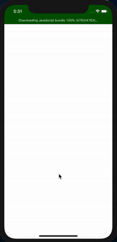

# route-screen-react-native

A simple example of how to handle multiple navigation in the same app

This example use [react-navigation](https://reactnavigation.org/docs/getting-started) with:

- drawer navigation
- nesting navigation
- tab navigation

### Example:

